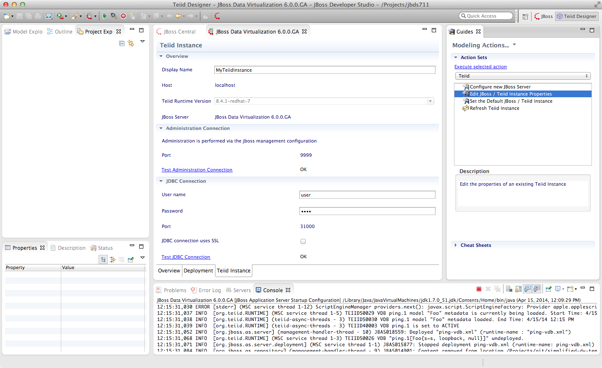

# What's this

This document show import mettadata from xml file, create & deploy virtual database and use JDBC interact with xml file. The content containing:

* Start JDV Server and Set up Teiid instance
* Creating a Teiid Project
* Import Metadata from a XML file 
* Preview Data via the Teiid Server
* Virtual Database Creation and Deployment
* JDBC access xml data via deployed VDB

# Start JDV Server and Set up Teiid instance

To open the “Teiid Designer” perspective, first select Window → Open Perspective → Other… in order for the full list of perspectives to be displayed and the “Teiid Designer” perspective to be selectable.

Start JDV Server, make sure the Test JDBC connection return `OK` as following figure:

# Creating a Teiid Project

To create the project, from the menu bar on JBDS, select File → New → Teiid Model Project, enter the project name `XMLDataSource`, select default setting for conpleting the Teiid Project Creation.

# Import Metadata from a XML file

Right-click on the `sources` folder and select import -> Teiid Designer, this time you will select the File Source (XML) >> Source and View Model to import a data source. Select the books.xml from local file system, named `BooksModel` in Source Defnition section, and named `Books` as table name.

# Preview Data via the Teiid Server

# Virtual Database Creation and Deployment

# JDBC access xml data via deployed VDB

